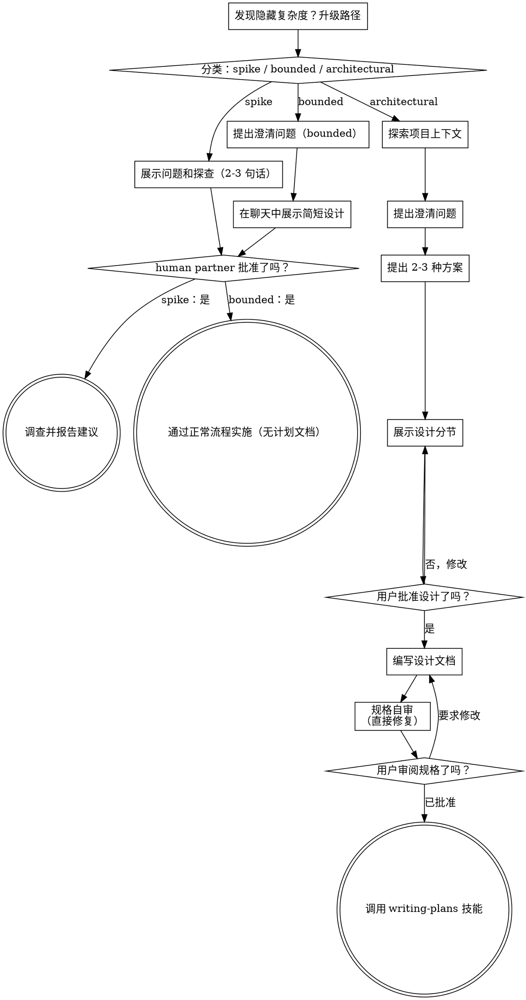

# 将想法转化为设计

通过自然、协作式对话，帮助把想法转化为完整的设计和规格说明。

先判断请求需要多少流程，再沿着相应路径推进：理解上下文、细化想法、展示设计，并获得 human partner 的批准。

<HARD-GATE>
在告诉 human partner 你的意图并获得批准之前，不得调用任何实施技能、编写代码、搭建项目或采取任何实施行动。这适用于下面的每一条路径、每一项任务——流程仪式会随任务规模调整，但批准门永远存在。
</HARD-GATE>

## 三条路径

在提出第一个问题前，先对请求分类并大声说明分类——“这看起来范围明确，所以我会在这里展示一个简短设计，而不是写规格说明”——让 human partner 可以纠正你的判断：

- **Spike**——可行性问题（“我们能不能……”“是否可能……”“快速粗略地做就行”），其输出是答案，而不是要保留的代码。用 2-3 句话说明问题和尝试方式，得到同意后，再在正确性允许的前提下以最低成本查明结果。不写设计文档、不写规格文件。将发现作为建议报告；任何构建内容都标记为一次性试验。
- **Bounded**——对本仓库已有代码的范围明确的修改：新增 flag、小型 endpoint、单文件修复。仅仅理解应用类型还不够——bounded 意味着要修改的流程已经存在于此、可以阅读。如果不存在可修改的既有流程，则不属于 bounded。提出重要的澄清问题，在聊天中展示简短设计（几句话到几段短文），然后停止。只有 human partner 对设计说“是”后才能开始实施——bounded 任务的批准门和架构任务一样严格。不写规格文件，不写实施计划文档。
- **Architectural**——新项目、新子系统、重构组件协作方式的变化，或会改变其他方依赖的接口。遵循完整流程：提问、提供方案、分节展示设计、编写规格说明，然后使用 writing-plans 技能。

如果无法在两条路径之间判断，选择更重的路径。这个棘轮只能向上：任务中途发现隐藏复杂度时升级路径——停下来说明并升级。任务中途不能降级。

## 反模式：“太简单，不需要批准”

每条路径都必须在实施前获得 human partner 对意图的批准。待办列表、单函数工具、配置修改——设计可以只是聊天中的两句话，但仍然必须展示并获得批准。未经检查的假设最容易在“简单”任务中造成浪费。随简单程度缩短的是产物，绝不是批准步骤。

## 红旗

| 想法 | 事实 |
|---------|---------|
| “这太简单了，不需要设计。” | 简单意味着设计简短，而不是没有设计。先在聊天中写两句话，再请求批准。 |
| “我把它称为 bounded，就可以跳过规格。” | 试图用标签跳过工作本身就是疑点——选择更重的路径。 |
| “它是 bounded，而且设计显而易见——他们阅读时我先开始。” | 门槛是批准，而不是设计长度。展示后必须停下，直到收到 yes。 |
| “我熟悉这种应用，所以它是 bounded。” | bounded 衡量的是仓库，而不是你的熟悉程度。新项目没有既有流程，属于 architectural。 |
| “Spike 能运行，所以我保留代码。” | Spike 的输出是答案。保留代码是新的请求——重新分类。 |
| “它变复杂了，但我快做完了——没必要重新分类。” | 隐藏复杂度会在任务中途升级路径。停下来并说明。 |
| “他们批准了 spike，所以后续修改也获批了。” | 每项任务都有自己的分类和批准。 |

## 清单

先分类并宣布路径，然后为路径上的每项创建任务，并按顺序完成。

**Spike：**
1. **探索项目上下文**——收集足以界定探查范围的信息
2. **展示问题和探查计划**——2-3 句话
3. **获得批准**——同意即可
4. **调查**——在正确性允许的前提下以最低成本进行
5. **报告发现**——给出建议；将任何构建内容标记为一次性试验

**Bounded：**
1. **探索项目上下文**——检查文件、文档和最近提交
2. **提出澄清问题**——一次一个，只问重要的问题
3. **在聊天中展示简短设计**——方案、涉及文件和测试
4. **获得批准**——停止并等待明确的 yes；展示设计后立即开始等于跳过门槛
5. **实施**——通过正常开发流程继续（适用 TDD）；不写计划文档

**Architectural：**
1. **探索项目上下文**——检查文件、文档和最近提交
2. **在需要时提供 visual companion**——不要提前提供。第一次遇到“展示比描述更清晰”的问题时再提供（单独发消息）；批准后浏览器标签页会为你打开。如果从未出现视觉问题，就永远不要提供。见下方 Visual Companion 部分。
3. **提出澄清问题**——一次一个，理解目的、约束和成功标准
4. **提出 2-3 种方案**——说明权衡并给出你的建议
5. **展示设计**——按复杂度分节，在每节之后获得用户批准
6. **写设计文档**——保存到 `docs/superpowers/specs/YYYY-MM-DD-<topic>-design.md` 并提交
7. **规格自审**——快速检查占位符、矛盾、歧义和范围（见下文）
8. **用户审阅书面规格**——在继续之前请用户审阅规格文件
9. **转入实施**——调用 writing-plans 技能创建实施计划

## 流程图

**终止状态绑定路径。**Architectural：头脑风暴之后唯一可以调用的技能是 writing-plans——绝不能调用 frontend-design、mcp-builder 或其他实施技能。Bounded：批准后直接通过正常开发流程实施，不写计划文档。Spike：终止状态是报告建议。

## 流程

以下小节服务于 bounded 和 architectural 路径（spike 会在“展示探查并获得同意”处停止）。从**探索方案**开始的部分是 architectural 路径的深度内容；对于 bounded 工作，项目上下文、几个问题和聊天中的简短设计就是完整流程。

**理解想法：**

- 先检查当前项目状态（文件、文档、最近提交）
- 提出详细问题前先评估范围：如果请求描述了多个独立子系统（例如“构建一个包含聊天、文件存储、计费和分析的平台”），立即指出。不要花时间细化一个需要先拆分的项目。
- 如果项目对单份规格而言过大，帮助用户拆分为子项目：哪些部分彼此独立、如何关联、按什么顺序构建？然后按正常设计流程对第一个子项目进行头脑风暴。每个子项目各自经历规格 → 计划 → 实施周期。
- 对于范围合适的项目，一次一个问题地细化想法
- 尽可能使用多选题，但也可以开放式提问
- 每条消息只问一个问题——如果一个主题需要更多探索，就拆成多条消息
- 聚焦于理解：目的、约束、成功标准

**探索方案：**

- 提出 2-3 种不同方案并说明权衡
- 以对话方式展示选项，同时给出建议和理由
- 先给出推荐方案并解释原因
- 严格遵循 YAGNI——从每个方案和设计中移除不必要功能

**展示设计：**

- 确信理解要构建的内容后，再展示设计
- 按复杂度调整每节长度：直接的问题写几句话，细微的问题可写 200-300 字
- 每节之后询问目前是否正确
- 覆盖：架构、组件、数据流、错误处理和测试
- 如果某处没有意义，要准备回去继续澄清

**为隔离和清晰而设计：**

- 将系统拆成更小的单元，每个单元只有一个清晰目的，通过定义良好的接口通信，并能独立理解和测试
- 对每个单元都应能回答：它做什么、如何使用、依赖什么？
- 不阅读内部实现，能理解单元做什么吗？可以在不破坏消费者的情况下修改内部实现吗？如果不能，边界就需要调整。
- 更小且边界清晰的单元也更容易处理——一次能放进上下文的代码越少，推理越可靠；文件聚焦时编辑也更可靠。文件变大通常说明它承担了过多职责。

**在已有代码库中工作：**

- 提出修改前先探索当前结构，遵循既有模式
- 如果现有代码的问题会影响当前工作（例如文件过大、边界不清、职责纠缠），将有针对性的改进纳入设计——优秀开发者会改进自己正在处理的代码
- 不要提出无关重构。始终聚焦于服务当前目标的内容

## 设计之后（architectural 路径）

**文档：**

- 将已验证的设计（规格）写入 `docs/superpowers/specs/YYYY-MM-DD-<topic>-design.md`
  -（用户对规格位置的偏好优先于此默认值）
- 如可用，使用 elements-of-style:writing-clearly-and-concisely 技能
- 将设计文档提交到 git

**规格自审：**
写完规格文档后，用全新的视角检查：

1. **占位符扫描：**是否存在“​​TBD”“TODO”、不完整章节或模糊要求？修复它们。
2. **内部一致性：**是否有章节互相矛盾？架构是否与功能描述一致？
3. **范围检查：**是否足够聚焦、能由单个实施计划完成，还是需要拆分？
4. **歧义检查：**某项要求是否可能有两种解释？如果是，选择一种并明确写出。

直接修复发现的问题。不需要重新审查，修好后继续。

**用户审阅门槛：**
规格自审循环通过后，请用户在继续前审阅书面规格：

> “规格已写入并提交到 `<path>`。请审阅它，并在我们开始编写实施计划前告诉我是否需要修改。”

等待用户回复。如果要求修改，完成修改并重新运行规格自审循环。只有用户批准后才能继续。

**实施：**

- 调用 writing-plans 技能创建详细实施计划
- 不要调用其他技能。writing-plans 是下一步。

## Visual Companion

这是一个基于浏览器的伴侣工具，用于在头脑风暴期间展示 mockup、图表和视觉选项。它是一个工具，而不是一种模式。接受 companion 只意味着它可用于适合视觉呈现的问题，并不意味着每个问题都要通过浏览器处理。

**及时提供 companion：**不要提前提供。等到某个问题确实“展示比描述更清楚”时再提供——必须是实际的 mockup、布局或图表问题，而不只是一个 UI 主题。第一次出现这种问题时，以单独消息提供：
> “下一部分展示出来可能更容易——我可以在浏览器标签页中逐步展示 mockup、图表和对比。这个工具还比较新，而且可能消耗较多 token。需要我使用吗？我会为你打开。”

**这条邀请必须单独成消息。**只能包含邀请，不得附带澄清问题、总结或其他内容。等待用户回复。用户接受后，使用 `--open` 启动服务器，让浏览器自动打开第一个界面。用户拒绝后继续纯文本，不要再次提供，除非他们主动提出。

**逐问题决策：**即使用户接受了 companion，也要为**每个问题**决定使用浏览器还是终端。判断标准：**用户通过看到它，是否会比阅读文字理解得更好？**

- **使用浏览器：**本身就是视觉内容的 mockup、wireframe、布局对比、架构图、并排视觉设计
- **使用终端：**文本内容，如需求问题、概念选择、权衡列表、A/B/C/D 文字选项和范围决策

关于 UI 主题的问题不自动等于视觉问题。“这里的 personality 是什么意思？”是概念问题，应使用终端；“哪个向导布局更好？”是视觉问题，应使用浏览器。

如果他们同意使用 companion，继续前先阅读详细指南：
`skills/brainstorming/visual-companion.md`
