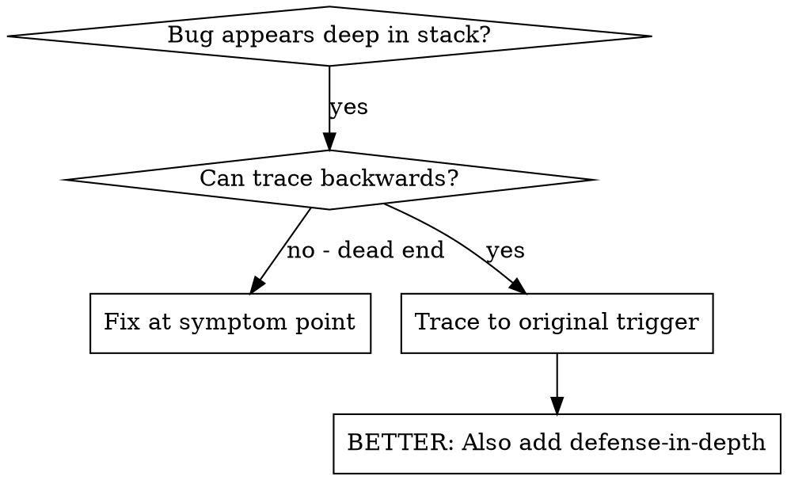
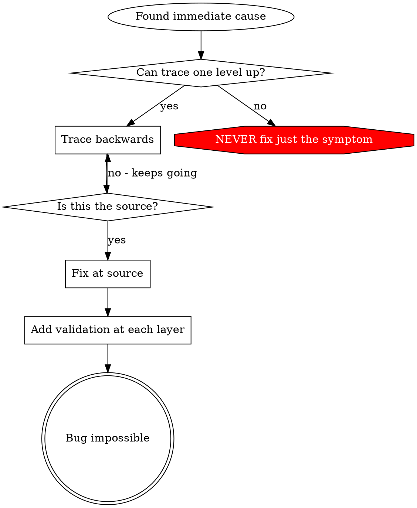

# 根因追踪

## 概述

Bug 经常在调用栈深处显现（git init 在错误目录、文件写入错误位置、数据库用错误路径打开）。你的直觉可能是修复错误出现的位置，但那是在处理症状。

**核心原则：**沿调用链反向追踪，直到找到最初触发点，然后在来源修复。

## 何时使用



**适用于：**
- 错误在执行深处发生（不是入口点）
- Stack trace 显示很长的调用链
- 不清楚无效数据从哪里产生
- 需要找出哪个测试/代码触发问题

## 追踪流程

### 1. 观察症状
```
Error: git init failed in ~/project/packages/core
```

### 2. 找到直接原因
**什么代码直接导致它？**
```typescript
await execFileAsync('git', ['init'], { cwd: projectDir });
```

### 3. 询问：谁调用了这里？
```typescript
WorktreeManager.createSessionWorktree(projectDir, sessionId)
  → 由 Session.initializeWorkspace() 调用
  → 由 Session.create() 调用
  → 由 Project.create() 处的测试调用
```

### 4. 持续向上追踪
**传入了什么值？**
- `projectDir = ''`（空字符串！）
- 空字符串作为 `cwd` 会解析为 `process.cwd()`
- 这就是源代码目录！

### 5. 找到最初触发点
**空字符串从哪里来？**
```typescript
const context = setupCoreTest(); // 返回 { tempDir: '' }
Project.create('name', context.tempDir); // 在 beforeEach 之前访问！
```

## 添加 Stack Trace

无法手动追踪时，增加 instrumentation：

```typescript
// 在有问题的操作之前
async function gitInit(directory: string) {
  const stack = new Error().stack;
  console.error('DEBUG git init:', {
    directory,
    cwd: process.cwd(),
    nodeEnv: process.env.NODE_ENV,
    stack,
  });

  await execFileAsync('git', ['init'], { cwd: directory });
}
```

**关键：**测试中使用 `console.error()`（不要用 logger——可能不会显示）。

**运行并捕获：**
```bash
npm test 2>&1 | grep 'DEBUG git init'
```

**分析 stack trace：**
- 查找测试文件名
- 找到触发调用的行号
- 识别模式（同一测试？同一参数？）

## 找出哪个测试造成污染

如果某物出现在测试期间，但不知道哪个测试导致：

使用本目录的二分脚本 `find-polluter.sh`：

```bash
./find-polluter.sh '.git' 'src/**/*.test.ts'
```

逐个运行测试，在第一个污染者处停止。用法见脚本。

## 真实示例：空 projectDir

**症状：**`.git` 被创建在 `packages/core/`（源代码目录）

**追踪链：**
1. `git init` 在 `process.cwd()` 中运行 ← cwd 参数为空
2. WorktreeManager 收到空 projectDir
3. Session.create() 传入空字符串
4. 测试在 beforeEach 之前访问 `context.tempDir`
5. setupCoreTest() 初始返回 `{ tempDir: '' }`

**根因：**顶层变量初始化时访问空值

**修复：**将 tempDir 改为 getter，在 beforeEach 之前访问时抛出错误

**同时加入深度防御：**
- 第一层：Project.create() 验证目录
- 第二层：WorkspaceManager 验证非空
- 第三层：NODE_ENV 保护拒绝在 tmpdir 外执行 git init
- 第四层：git init 前记录 stack trace

## 核心原则



**绝不要只修复错误出现的位置。**回溯寻找最初触发点。

## Stack Trace 提示

**测试中：**使用 `console.error()`，不要用 logger——logger 可能被抑制
**操作前：**在危险操作前记录，而不是失败后记录
**包含上下文：**目录、cwd、环境变量、时间戳
**捕获 stack：**`new Error().stack` 显示完整调用链

## 实际影响

来自调试会话（2025-10-03）：
- 通过 5 层追踪找到根因
- 在来源修复（getter 验证）
- 增加 4 层防御
- 1847 个测试通过，零污染
