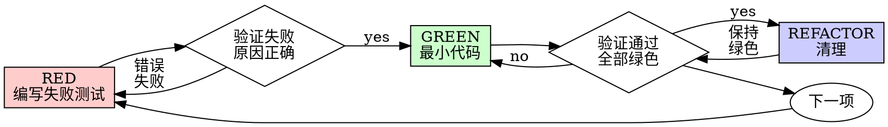

# 测试驱动开发（TDD）

先写测试。观察测试失败。编写能通过测试的最小代码。

**核心原则：**如果没有亲眼看到测试失败，就不知道它是否真的测试了正确的内容。

**违反规则的字面要求，就是违反规则的精神。**

## 何时使用

**始终使用：**
- 新功能
- Bug 修复
- 重构
- 行为变更

**例外（询问 human partner）：**
- 一次性原型
- 生成的代码
- 配置文件

想着“这次跳过 TDD 吧”？停止。这是在合理化。

## 铁律

```
没有先失败的测试，就不能编写生产代码
```

先写代码后写测试？删除代码，重新开始。

**没有例外：**
- 不要把它保留为“参考”
- 不要一边写测试一边改造它
- 不要再看它
- 删除就是删除

从测试开始重新实现。就这样。

## Red-Green-Refactor



### RED——编写失败测试

写一个展示预期行为的最小测试。

<Good>
```typescript
test('retries failed operations 3 times', async () => {
  let attempts = 0;
  const operation = () => {
    attempts++;
    if (attempts < 3) throw new Error('fail');
    return 'success';
  };

  const result = await retryOperation(operation);

  expect(result).toBe('success');
  expect(attempts).toBe(3);
});
```
名称清晰，测试真实行为，只测试一件事
</Good>

<Bad>
```typescript
test('retry works', async () => {
  const mock = jest.fn()
    .mockRejectedValueOnce(new Error())
    .mockRejectedValueOnce(new Error())
    .mockResolvedValueOnce('success');
  await retryOperation(mock);
  expect(mock).toHaveBeenCalledTimes(3);
});
```
名称含糊，测试的是 mock 而不是代码
</Bad>

**要求：**
- 一个行为
- 清晰名称
- 真实代码（除非无法避免，否则不要使用 mock）

### 验证 RED——观察失败

**强制要求，绝不能跳过。**

```bash
npm test path/to/test.test.ts
```

确认：
- 测试失败（不是发生错误）
- 失败消息符合预期
- 失败原因是功能缺失（不是拼写错误）

**测试通过了？**你测的是已有行为。修正测试。

**测试发生错误？**修复错误，重复运行，直到它正确失败。

### GREEN——最小代码

编写通过测试的最简单代码。

<Good>
```typescript
async function retryOperation<T>(fn: () => Promise<T>): Promise<T> {
  for (let i = 0; i < 3; i++) {
    try {
      return await fn();
    } catch (e) {
      if (i === 2) throw e;
    }
  }
  throw new Error('unreachable');
}
```
只写足够通过测试的内容
</Good>

<Bad>
```typescript
async function retryOperation<T>(
  fn: () => Promise<T>,
  options?: {
    maxRetries?: number;
    backoff?: 'linear' | 'exponential';
    onRetry?: (attempt: number) => void;
  }
): Promise<T> {
  // YAGNI
}
```
过度工程化
</Bad>

不要添加功能、重构其他代码，或超出测试要求进行“改进”。

### 验证 GREEN——观察通过

**强制要求。**

```bash
npm test path/to/test.test.ts
```

确认：
- 测试通过
- 其他测试仍然通过
- 输出干净（没有错误或警告）

**测试失败？**修复代码，不要修复测试。

**其他测试失败？**立即修复。

### REFACTOR——清理

只有在绿色之后：
- 删除重复
- 改进命名
- 提取辅助函数

保持测试绿色。不要添加行为。

### 重复

为下一个功能编写下一个失败测试。

## 好测试

| 质量 | 好 | 坏 |
|---------|------|-----|
| **最小** | 只做一件事。名称里出现“和”？拆开。 | `test('validates email and domain and whitespace')` |
| **清晰** | 名称描述行为 | `test('test1')` |
| **表达意图** | 展示期望的 API | 让代码无法看出应做什么 |

编写或修改任何测试时，阅读 [writing-good-tests.md](writing-good-tests.md)，其中包含保持测试诚实的规则：
- 写测试前先命名会让测试失败的生产代码变更
- 断言真实行为，绝不要断言 mock 行为
- 将仅供测试使用的代码放在测试工具中，不要放进生产类
- mock 依赖前先理解其副作用

## 常见合理化

| 借口 | 事实 |
|---------|---------|
| “太简单，不值得测试。” | 简单代码也会坏。测试只需 30 秒。 |
| “稍后再测试。” | 事后编写的测试会立即通过，这证明不了任何事。它可能测错内容、测实现而非行为，或漏掉你忘记的边界情况。你没有观察它失败，就没有证明它能捕获 bug。测试优先会强制产生这个失败。 |
| “事后测试达成同样目标（这是精神而非仪式）。” | 事后测试回答“它做了什么？”；测试优先回答“它应该做什么？”。先写代码会让测试偏向你已经实现的内容，只验证记得的场景，而非测试优先会发现的场景。覆盖率没有证明测试有效。 |
| “我已经手动测试过了。” | 手动测试是临时的：没有覆盖记录，代码变化后不能可靠重跑，压力下容易忘记边界。“我试过能跑”不等于全面。自动化测试每次都以相同方式运行。 |
| “删除几小时的工作太浪费。” | 这是沉没成本谬误。时间无论如何已经花掉了。真正选择是用 TDD 高置信度重写，还是保留无法信任的代码再补测试，后者更可能产生 bug。保留无法信任的代码才是浪费。 |
| “保留作参考，同时先写测试。” | 你会改造它。这就是事后测试。删除就是删除。 |
| “我需要先探索。” | 可以探索，但丢弃探索结果，从 TDD 重新开始。 |
| “难以测试说明设计不清晰。” | 听从测试。难以测试就难以使用。 |
| “TDD 会拖慢我。” | TDD 才是务实路径：提交前发现 bug、防止回归、让你可以无惧重构。“务实”的捷径意味着在生产环境调试，更慢而不是更快。 |
| “手动测试更快。” | 手动测试不能证明边界情况。每次修改后你都要重测。 |
| “现有代码没有测试。” | 你正在改进它。为现有代码添加测试。 |

## 红旗——停止并重新开始

- 测试之前写代码
- 实现之后写测试
- 测试立即通过
- 无法解释测试为什么失败
- 测试“以后再加”
- 为“就这一次”找理由
- “我已经手动测试过了”
- “事后测试目的相同”
- “这是精神问题，不是仪式问题”
- “保留作参考”或“改造现有代码”
- “已经花了 X 小时，删除太浪费”
- “TDD 太教条，我是在务实”
- “这次情况不同，因为……”

**这些想法都意味着：删除代码，从 TDD 重新开始。**

## 示例：Bug 修复

**Bug：**接受空 email

**RED**
```typescript
test('rejects empty email', async () => {
  const result = await submitForm({ email: '' });
  expect(result.error).toBe('Email required');
});
```

**验证 RED**
```bash
$ npm test
FAIL: expected 'Email required', got undefined
```

**GREEN**
```typescript
function submitForm(data: FormData) {
  if (!data.email?.trim()) {
    return { error: 'Email required' };
  }
  // ...
}
```

**验证 GREEN**
```bash
$ npm test
PASS
```

**REFACTOR**

如果需要，为多个字段提取验证逻辑。

## 验证清单

标记工作完成前：

- [ ] 每个新函数/方法都有测试
- [ ] 实现前观察每个测试失败
- [ ] 每个测试因预期原因失败（功能缺失，而不是拼写错误）
- [ ] 编写了通过测试的最小代码
- [ ] 所有测试通过
- [ ] 输出干净（没有错误或警告）
- [ ] 测试使用真实代码（除非无法避免，否则不使用 mock）
- [ ] 覆盖边界情况和错误

无法勾选全部项目？你跳过了 TDD。从头开始。

## 遇到困难时

| 问题 | 解决方案 |
|---------|----------|
| 不知道如何测试 | 写出期望的 API。先写断言。询问 human partner。 |
| 测试太复杂 | 设计太复杂。简化接口。 |
| 必须 mock 所有内容 | 代码耦合太紧。使用依赖注入。 |
| 测试设置很庞大 | 提取辅助函数。仍然复杂？简化设计。 |

## 调试集成

发现 bug？写一个能复现它的失败测试。遵循 TDD 循环。测试既证明修复，也防止回归。

绝不要没有测试就修复 bug。

## 最终规则

```
生产代码 → 测试存在且先失败
否则 → 不是 TDD
```

没有 human partner 的许可就没有例外。
